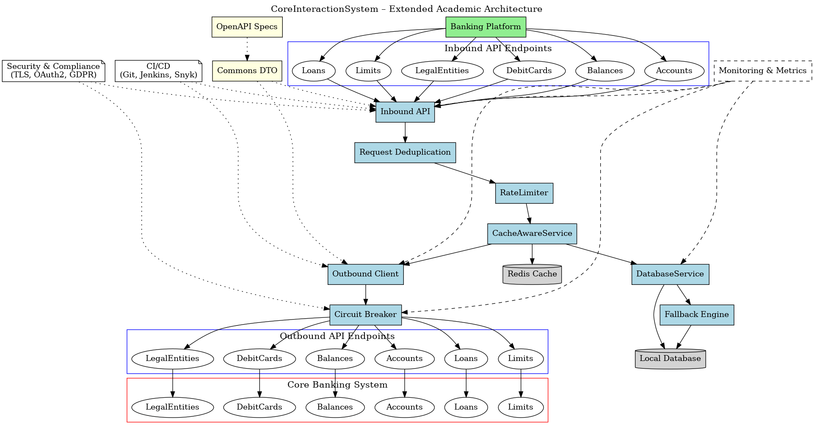

# CoreInteractionSystem

**CoreInteractionSystem** is a modular Java platform based on Spring Boot, designed to optimize interaction between a banking platform and legacy core systems through caching, throttling, fallback logic, idempotency, and monitoring.

---

## 📦 Module Architecture

| Module                  | Description                                                                 |
|-------------------------|-----------------------------------------------------------------------------|
| `api-specs`             | OpenAPI 3.0 YAML files: schemas, endpoints, SSOT                           |
| `commons`               | DTOs generated from specifications, reused across modules                  |
| `inbound-api`           | REST controllers, entry points, includes rate-limiting support             |
| `outbound-client`       | WebClient / RestTemplate clients for external core systems                 |
| `database`              | Local storage via Spring Data JPA, used for fallback scenarios             |
| `circuit-breaker`       | Circuit breaker logic using Resilience4j with fallback wrappers            |
| `fallback-engine`       | Centralized logic for serving fallback data from the local database        |
| `monitoring`            | AOP-based logging and metrics collection using Micrometer                  |
| `request-deduplication` | Idempotency support via annotations and AOP aspect                         |

---

## ⚙️ Key Features

- **Service-level caching** (Redis, Caffeine)
- **Rate limiting on controllers** (`@RateLimiter`)
- **Circuit breaker** integration using `CircuitBreakerExecutor`
- **Fallback data** returned from the database during core system failures
- **@Idempotent** annotation for POST requests with result reuse
- **Monitoring and logging** using AOP and Micrometer

---

## 🚀 Quick Start

```bash
mvn clean install
```


---

## 🛠 Usage

To build and run the platform locally:

```bash
mvn clean install
cd inbound-api
mvn spring-boot:run
```

To regenerate DTOs from OpenAPI specs:

```bash
cd commons
mvn clean compile
```

Make sure to configure access to Redis and your database (PostgreSQL, MySQL, etc.) via `application.yml`.

---

## 🗂 Architecture Diagram

A high-level system architecture can be visualized using the diagram below:



This diagram outlines the interaction between inbound APIs, service layers, caching, fallback mechanisms, outbound connectors, and external core systems.

---

## 📄 License

This project is licensed under the MIT License. You are free to use, modify, and distribute it under the terms of the license.

